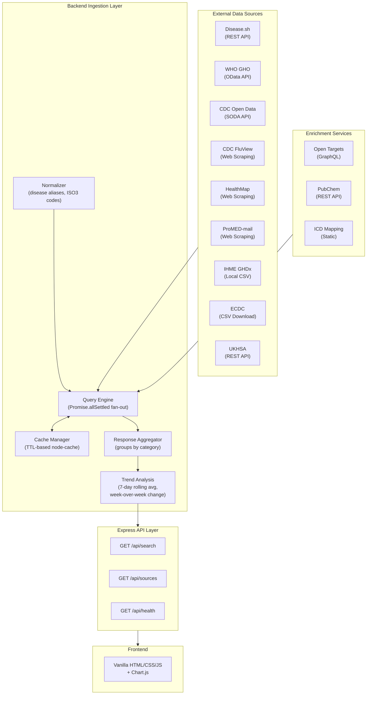

# Disease Surveillance Dashboard

**A unified, multi-source disease intelligence platform that aggregates data from 9 public health sources and 3 enrichment services into a single contextualized surveillance view.**

---

## Overview

Tracking disease outbreaks across the globe requires monitoring a fragmented landscape of public health databases, each with its own API format, update cadence, and data model. Epidemiologists and public health analysts must manually query WHO, CDC, ECDC, and other organizations separately, then mentally stitch together the results.

The **Disease Surveillance Dashboard** solves this by providing a single query interface that fans out to 12 data source connectors in parallel, normalizes the results into a unified schema, enriches them with genomic and pharmacological context, and presents everything through an interactive dark-themed dashboard with trend visualizations.

Enter a disease name (e.g., "malaria") and an optional region (e.g., "India"), and the system returns epidemiological statistics, outbreak alerts, ICD classification codes, gene-disease associations, therapeutic compounds, and computed trend analyses -- all in under 15 seconds.

## Key Features

- **Multi-source data aggregation** -- Fan-out query engine hits 12 connectors in parallel using `Promise.allSettled()` for maximum coverage and fault tolerance
- **Disease & region normalization** -- Maps 50+ synonyms/abbreviations to canonical disease names and 100+ regions to ISO 3166-1 alpha-3 codes
- **Genomic & pharmacological enrichment** -- Integrates Open Targets (GraphQL), PubChem compound data, and ICD-10/ICD-11 classification
- **Trend analysis** -- Computes 7-day rolling averages and week-over-week directional trends from time-series data
- **Interactive visualization** -- Dark-themed biosurveillance HUD with Chart.js trend charts, severity indicators, and evidence-score bars
- **In-memory caching** -- TTL-based cache (`node-cache`) with per-connector TTLs to minimize redundant API calls
- **Graceful degradation** -- Individual connector failures are isolated; the dashboard returns all available data even if some sources are down

## Data Sources

### Primary Sources (9)

| # | Source | Access Method | Data Provided |
|---|--------|---------------|---------------|
| 1 | **Disease.sh** | REST API | Real-time COVID-19 global/country/historical statistics |
| 2 | **WHO GHO** | OData API | WHO Global Health Observatory indicators and mortality data |
| 3 | **CDC Open Data** | SODA API | U.S. CDC surveillance datasets via Socrata Open Data API |
| 4 | **CDC FluView** | Web Scraping / CSV | CDC influenza surveillance data (ILI rates, clinical specimens) |
| 5 | **HealthMap** | Web Scraping | Real-time outbreak alerts and disease event reports |
| 6 | **ProMED-mail** | Web Scraping | Emerging infectious disease reports from the ProMED network |
| 7 | **IHME GHDx** | Local CSV | Global Burden of Disease data (pre-bundled India sample, 18 diseases, 2010-2021) |
| 8 | **ECDC** | CSV Download | European Centre for Disease Prevention and Control surveillance data |
| 9 | **UKHSA** | REST API | UK Health Security Agency surveillance statistics |

### Enrichment Modules (3)

| # | Module | Access Method | Data Provided |
|---|--------|---------------|---------------|
| 10 | **Open Targets** | GraphQL API | Gene-disease associations, target evidence scores |
| 11 | **PubChem** | REST API | Drug/compound properties, mechanism of action, WHO Essential Medicines status |
| 12 | **ICD Mapping** | Static Lookup | ICD-10 and ICD-11 classification codes for 23 diseases |

## Architecture

The system follows a three-tier architecture: external data sources feed into a backend ingestion/aggregation layer, which serves a frontend visualization dashboard through a REST API.



**Data Flow:**
1. User submits a disease/region query from the frontend
2. The **Normalizer** resolves disease aliases and region names to canonical identifiers
3. The **Query Engine** fans out requests to all 12 connectors in parallel via `Promise.allSettled()`
4. The **Cache Manager** intercepts each request -- on cache hit, the stored result is returned; on miss, the connector fetches live data
5. The **Response Aggregator** groups results into five categories: `epidemiological`, `outbreakAlerts`, `classification`, `genomicAssociations`, `therapeutics`
6. The **Trend Analysis** engine computes rolling averages and directional trends from time-series data
7. The unified response is returned through the Express API to the frontend for visualization

## Tech Stack

| Layer | Technologies |
|-------|-------------|
| **Backend** | Node.js, Express |
| **Frontend** | Vanilla HTML/CSS/JS, Chart.js |
| **HTTP Client** | Axios |
| **Web Scraping** | Cheerio |
| **Data Parsing** | csv-parse, xml2js |
| **Caching** | node-cache |
| **Dev Tooling** | Nodemon |

## Getting Started

### Prerequisites

- **Node.js** >= 18.x
- **npm** (bundled with Node.js)

### Installation

```bash
# Clone the repository
git clone <repository-url>
cd cb_hack

# Install dependencies
npm install
```

### Running

```bash
# Start the server (port 3000)
npm start

# Or use nodemon for development (auto-restart on changes)
npm run dev
```

Then open [http://localhost:3000](http://localhost:3000) in your browser.

### Usage

1. Enter a **disease name** (e.g., "malaria", "COVID-19", "tuberculosis") and/or a **region** (e.g., "India", "United States", "Europe")
2. Click **Search** -- the dashboard queries all sources in parallel
3. View aggregated results organized by category, enrichment data, trend charts, and genomic associations

## API Reference

### `GET /api/health`

Server health check.

**Parameters:** None

**Example Request:**
```bash
curl http://localhost:3000/api/health
```

**Example Response:**
```json
{
  "status": "ok",
  "timestamp": "2026-03-17T12:00:00.000Z",
  "uptime": 3600.123
}
```

---

### `GET /api/sources`

List all available data source connectors and their status.

**Parameters:** None

**Example Request:**
```bash
curl http://localhost:3000/api/sources
```

**Example Response:**
```json
{
  "count": 12,
  "sources": [
    { "name": "Disease.sh", "type": "REST API", "status": "available", "description": "COVID-19 global/country/historical data" },
    { "name": "WHO GHO", "type": "OData API", "status": "available", "description": "WHO Global Health Observatory indicators" },
    { "name": "CDC Open Data", "type": "SODA API", "status": "available", "description": "CDC disease statistics via SODA" },
    { "name": "CDC FluView", "type": "Scraping/CSV", "status": "available", "description": "CDC influenza surveillance data" },
    { "name": "HealthMap", "type": "Web Scraping", "status": "available", "description": "Outbreak alerts from HealthMap" },
    { "name": "ProMED Mail", "type": "Web Scraping", "status": "available", "description": "ProMED outbreak alert posts" },
    { "name": "IHME GHDx", "type": "Local CSV", "status": "available", "description": "India disease burden data (pre-bundled)" },
    { "name": "ECDC", "type": "CSV Download", "status": "available", "description": "European CDC surveillance data" },
    { "name": "UKHSA", "type": "REST API", "status": "available", "description": "UK Health Security Agency data" },
    { "name": "Open Targets", "type": "GraphQL", "status": "available", "description": "Gene-disease associations" },
    { "name": "PubChem", "type": "REST API", "status": "available", "description": "Drug/compound information" },
    { "name": "ICD Mapping", "type": "Static", "status": "available", "description": "ICD-10/ICD-11 disease classification" }
  ]
}
```

---

### `GET /api/search`

Main unified search endpoint. Queries all data sources in parallel and returns aggregated results.

**Parameters:**

| Parameter | Type | Required | Description |
|-----------|------|----------|-------------|
| `disease` | string | Yes | Disease name (e.g., "covid", "malaria", "flu"). Aliases are resolved automatically. |
| `region` | string | No | Region or country name (e.g., "India", "US", "global"). Mapped to ISO3 codes automatically. |
| `sources` | string | No | Comma-separated list of source names to query (e.g., "Disease.sh,WHO GHO"). Defaults to all. |
| `timeout` | number | No | Per-connector timeout in milliseconds (default: 15000, max: 60000). |

**Example Request:**
```bash
curl "http://localhost:3000/api/search?disease=covid&region=india"
```

**Example Response Shape:**
```json
{
  "query": {
    "disease": "covid-19",
    "diseaseRaw": "covid",
    "region": "india",
    "regionISO3": "IND",
    "aliases": ["covid-19", "covid", "covid19", "sars-cov-2", "sarscov2", "coronavirus", "corona", "novel coronavirus"]
  },
  "timestamp": "2026-03-17T12:00:00.000Z",
  "totalLatency": 4523,
  "results": {
    "epidemiological": {
      "Disease.sh": { "...": "country stats, historical timeline" },
      "WHO GHO": { "...": "indicator values" },
      "CDC Open Data": { "...": "surveillance records" },
      "IHME GHDx": { "...": "burden of disease records" }
    },
    "outbreakAlerts": [
      { "source": "HealthMap", "title": "...", "date": "...", "link": "..." },
      { "source": "ProMED Mail", "title": "...", "date": "...", "link": "..." }
    ],
    "classification": {
      "icd10": "U07.1",
      "icd11": "RA01.0",
      "diseaseName": "covid-19"
    },
    "genomicAssociations": {
      "associations": [
        { "source": "Open Targets", "targetSymbol": "ACE2", "score": 0.85, "...": "..." }
      ],
      "diseaseInfo": { "id": "MONDO_0100096", "name": "COVID-19" }
    },
    "therapeutics": [
      { "source": "PubChem", "name": "Remdesivir", "cid": 121304016, "...": "..." }
    ],
    "trendAnalysis": {
      "diseaseSh_cases": {
        "source": "Disease.sh",
        "metric": "cases",
        "period": "3/1/26 – 3/17/26",
        "dataPoints": 17,
        "totalChange": 12345,
        "dailyAverage": 726,
        "trendDirection": "decreasing",
        "weekOverWeekChange": -12.3
      }
    }
  },
  "sources": [
    { "name": "Disease.sh", "status": "ok", "latency": 892, "message": null, "cached": false },
    { "name": "WHO GHO", "status": "ok", "latency": 1523, "message": null, "cached": true }
  ],
  "summary": {
    "totalSources": 12,
    "successful": 10,
    "skipped": 0,
    "failed": 2,
    "cachedResponses": 3
  },
  "cache": {
    "keys": 15,
    "hits": 3,
    "misses": 9,
    "hitRate": "25.0%"
  }
}
```

## Project Structure

```
cb_hack/
├── server/
│   ├── index.js                        # Express entry point, middleware, static serving
│   ├── routes/
│   │   └── api.js                      # API route definitions (/health, /sources, /search)
│   ├── services/
│   │   ├── queryEngine.js              # Core fan-out orchestrator (Promise.allSettled)
│   │   ├── normalizer.js               # Disease alias + region ISO3 normalization
│   │   ├── connectors/
│   │   │   ├── diseaseSh.js            # Disease.sh REST API connector
│   │   │   ├── whoGho.js               # WHO Global Health Observatory OData connector
│   │   │   ├── cdcOpen.js              # CDC Open Data SODA API connector
│   │   │   ├── cdcFluView.js           # CDC FluView web scraper
│   │   │   ├── healthMap.js            # HealthMap outbreak alert scraper
│   │   │   ├── promedMail.js           # ProMED-mail web scraper
│   │   │   ├── ihmeGhdx.js             # IHME GHDx local CSV parser
│   │   │   ├── ecdc.js                 # ECDC CSV download connector
│   │   │   └── ukshaApi.js             # UKHSA REST API connector
│   │   └── enrichment/
│   │       ├── openTargets.js          # Open Targets GraphQL connector
│   │       ├── pubchem.js              # PubChem REST API connector
│   │       └── icdMapping.js           # ICD-10/ICD-11 static mapping
│   ├── cache/
│   │   └── cacheManager.js            # TTL-based in-memory cache (node-cache)
│   ├── utils/
│   │   └── helpers.js                  # Shared utility functions
│   └── data/
│       └── ihme_india_sample.csv       # Pre-bundled IHME India sample data (88 rows)
├── public/
│   ├── index.html                      # Single-page app shell
│   ├── app.js                          # Frontend logic, rendering, Chart.js integration
│   └── style.css                       # Dark biosurveillance HUD theme
├── package.json
├── nodemon.json
└── .gitignore
```

## How It Works

The query engine follows a five-step pipeline for every search request:

### Step 1: Normalization

The **Normalizer** (`server/services/normalizer.js`) processes raw user input:
- **Disease names** are resolved through 50+ alias mappings (e.g., "flu" -> "influenza", "corona" -> "covid-19", "tb" -> "tuberculosis")
- **Region names** are mapped to ISO 3166-1 alpha-3 codes from 100+ entries (e.g., "India" -> `IND`, "US" -> `USA`, "UK" -> `GBR`)
- Both canonical names and all known aliases are passed to connectors for broader matching

### Step 2: Parallel Fan-Out

The **Query Engine** (`server/services/queryEngine.js`) dispatches requests to all 12 connectors simultaneously using `Promise.allSettled()`. Each connector is wrapped with:
- **Timeout isolation** -- individual connector timeout (default 15s, max 60s) via `Promise.race()`
- **Error isolation** -- a failing connector does not affect others; errors are captured and reported in the response metadata

### Step 3: Caching

The **Cache Manager** (`server/cache/cacheManager.js`) intercepts every connector call with a `getOrFetch()` pattern:
- Cache keys follow the format `{connector}:{disease}:{region}`
- On cache hit, the stored result is returned immediately (no network call)
- On cache miss, the connector fetches live data and the result is cached with a connector-specific TTL

### Step 4: Aggregation

The **Response Aggregator** groups connector results into five semantic categories:
- `epidemiological` -- keyed by source name (Disease.sh, WHO GHO, CDC, IHME, ECDC, UKHSA)
- `outbreakAlerts` -- flattened array of alerts from HealthMap and ProMED-mail
- `classification` -- ICD-10 and ICD-11 codes
- `genomicAssociations` -- gene-disease association scores from Open Targets
- `therapeutics` -- compound data from PubChem

### Step 5: Trend Analysis

The **Trend Analysis** engine processes time-series data from epidemiological sources:
- **Disease.sh timelines**: converts cumulative counts to daily new cases, computes 7-day rolling averages, and calculates week-over-week percent change
- **IHME multi-year records**: analyzes annual data across measures (Deaths, DALYs, Prevalence), computing annual rate of change and overall trend direction
- Trends are classified as `increasing` (>5% change), `decreasing` (<-5%), or `stable`

## Caching Strategy

Each connector has a TTL tuned to its data update frequency:

| Connector | TTL | Rationale |
|-----------|-----|-----------|
| Disease.sh | 600s (10 min) | REST API, moderate update frequency |
| WHO GHO | 1800s (30 min) | OData API, infrequent updates |
| CDC Open Data | 1200s (20 min) | SODA API, weekly updates |
| CDC FluView | 1800s (30 min) | Weekly surveillance data |
| HealthMap | 300s (5 min) | Scraped, may change frequently |
| ProMED-mail | 300s (5 min) | Scraped, may change frequently |
| IHME GHDx | 3600s (60 min) | Local CSV, static data |
| ECDC | 1800s (30 min) | Weekly published CSVs |
| UKHSA | 1200s (20 min) | REST API, moderate updates |
| ICD Mapping | 86400s (24 hr) | Static mapping, rarely changes |
| Open Targets | 1800s (30 min) | GraphQL, stable data |
| PubChem | 1800s (30 min) | REST API, stable data |

Cache keys follow the format `{connectorName}:{disease}:{region}` and expired entries are checked every 120 seconds.
